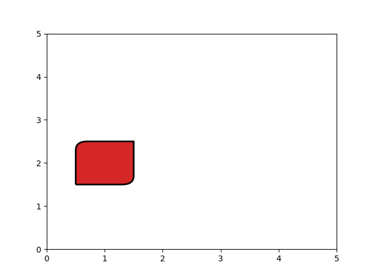

# Mpl Rounded Rectangle

An upgrade to Matplotlib's rectangle patch.

Contrary to FancyBboxPatch, RoundedRectangle doesn't inflate the rectangle.

#### Install 

    pip install .

Or install with a symlink, making changes come into action immediatelly
    
    pip install -e .
    
#### Demo

    python3 RoundedRectangle.py
    
#### Example
    
